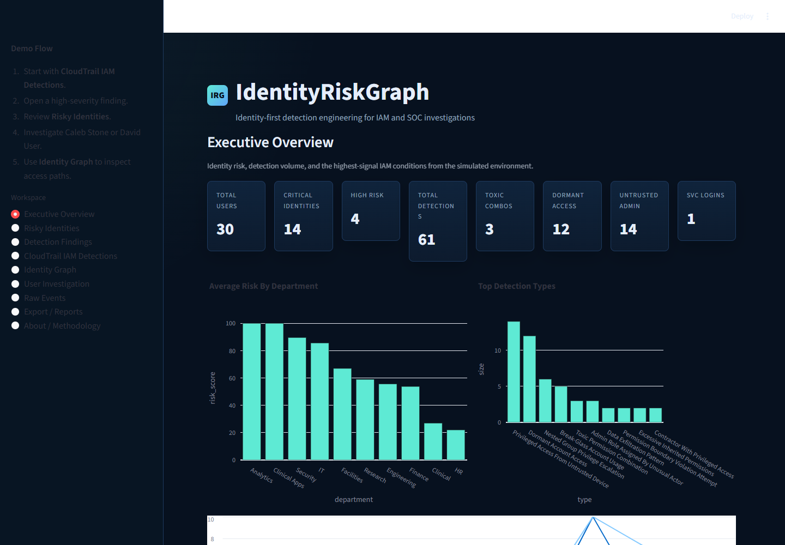
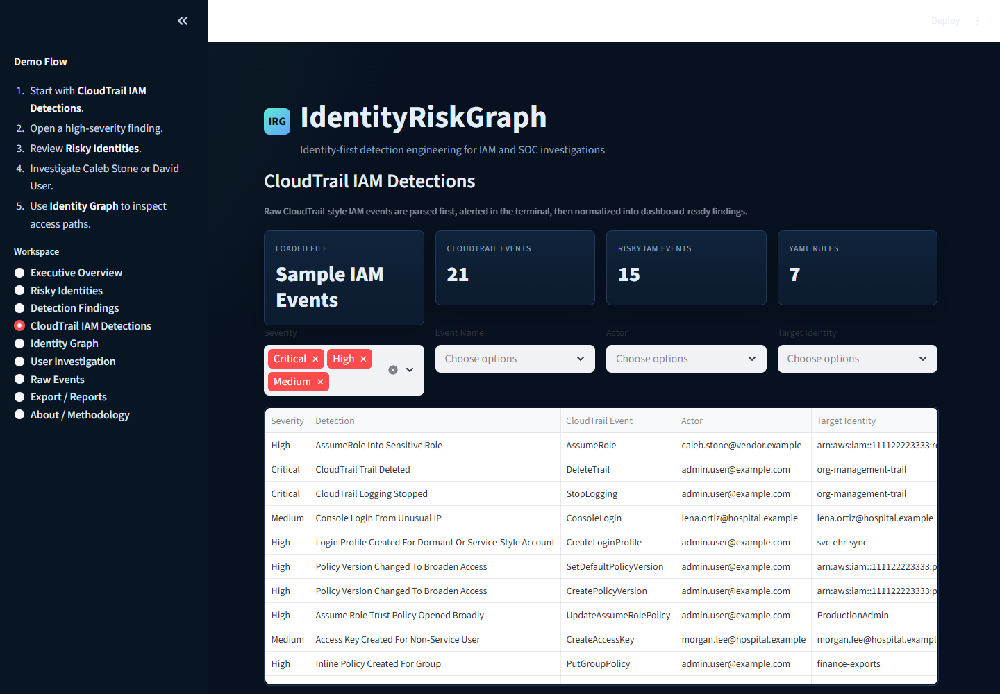
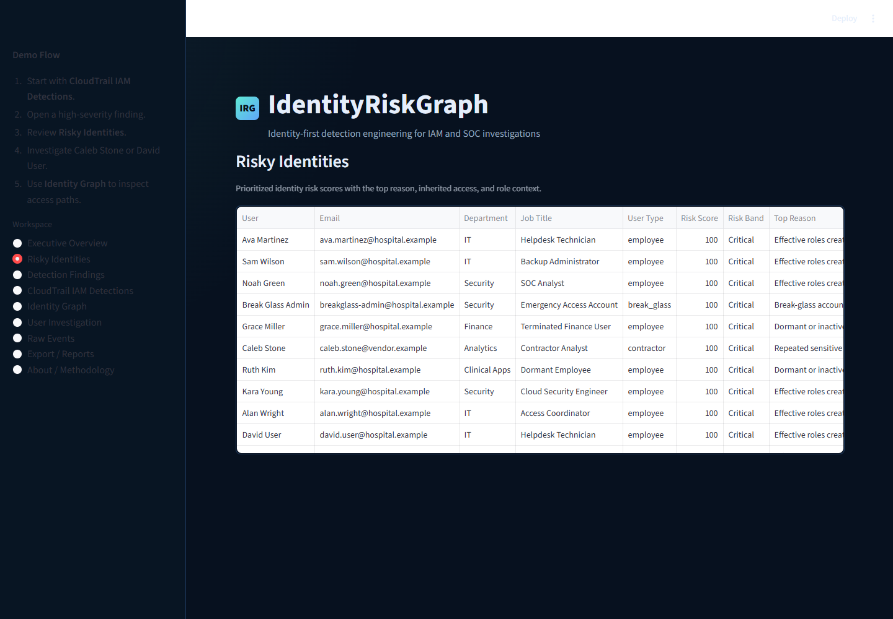
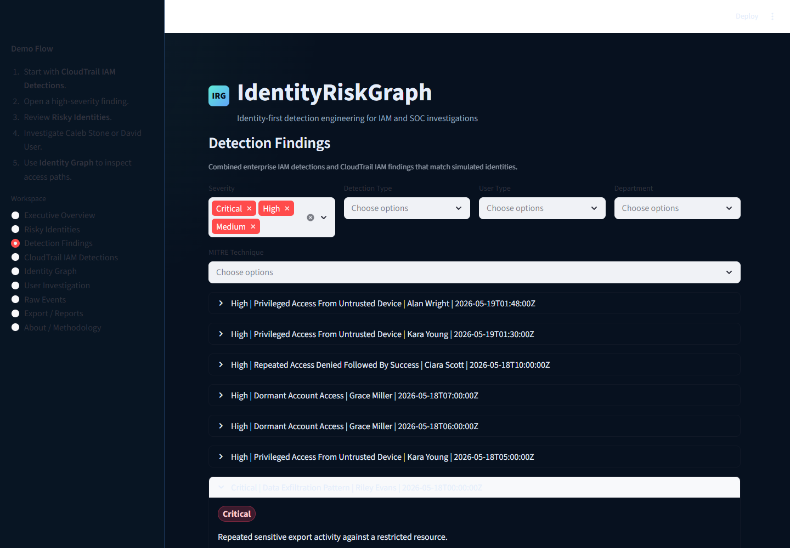
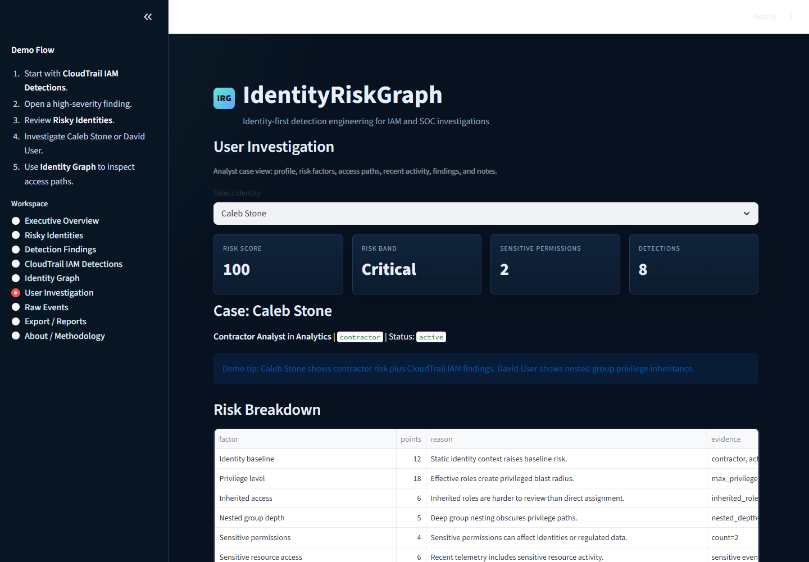
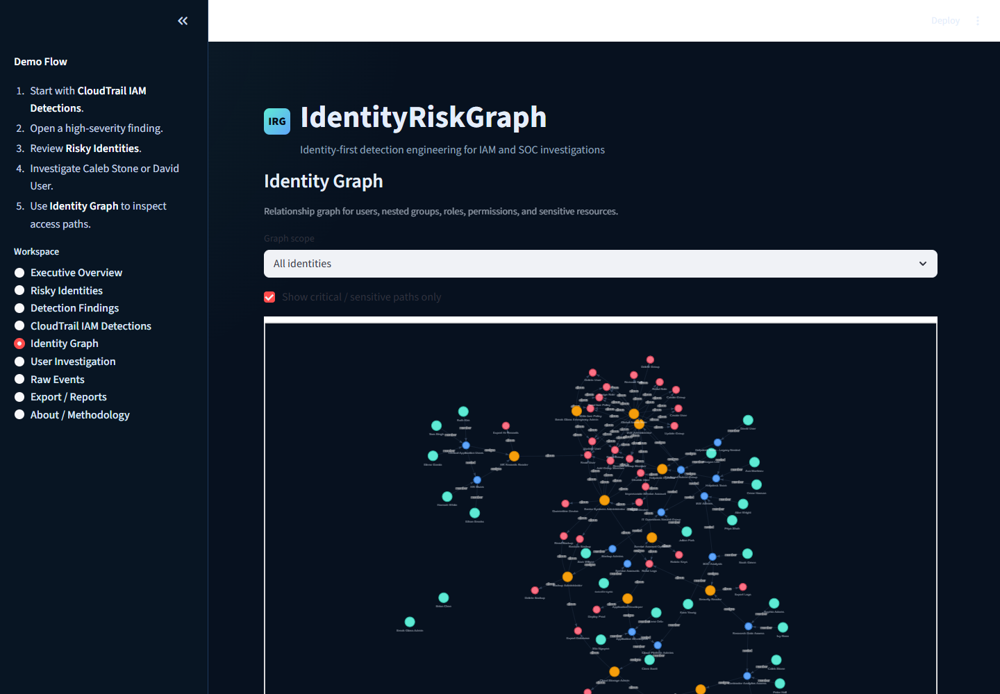
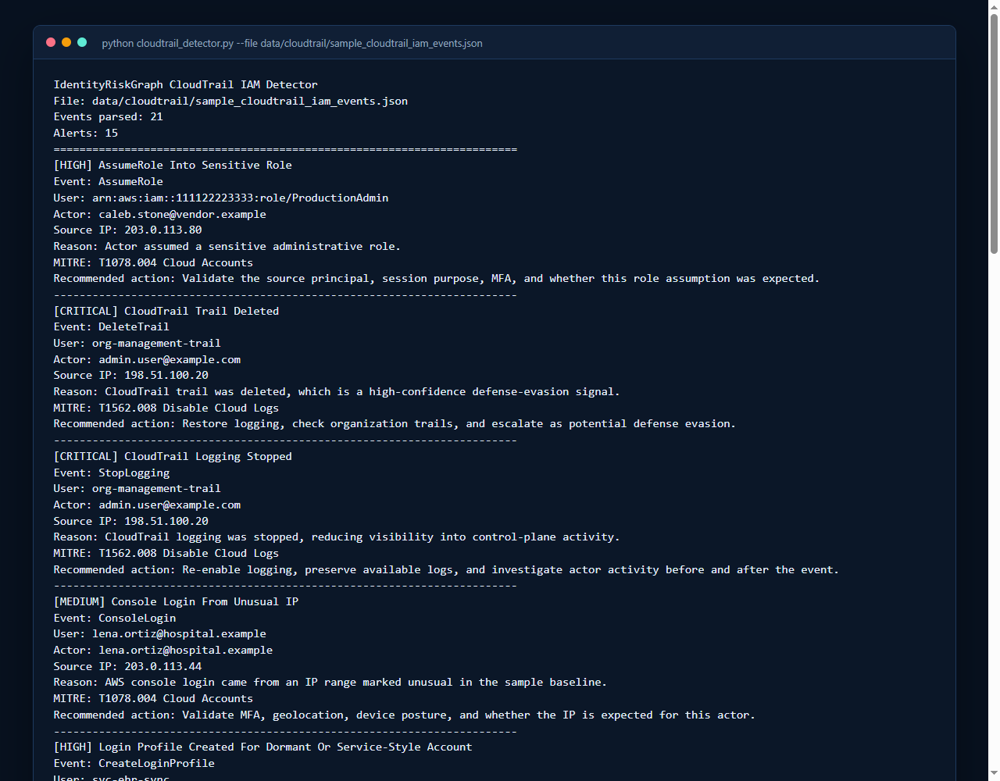
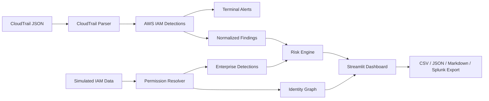

# IdentityRiskGraph


**Identity-first detection engineering for AWS IAM, nested access paths, and SOC-style risk investigation.**

IdentityRiskGraph starts with realistic CloudTrail IAM events, detects risky identity control-plane changes, resolves nested access paths, and turns noisy IAM activity into explainable risk scores and dashboard-ready investigations.



## Screenshots And Demo

Real screenshots from the running app and terminal detector are stored in [screenshots/](screenshots/).

| View | Screenshot |
|---|---|
| Executive Overview |  |
| CloudTrail IAM Detections |  |
| Risky Identities |  |
| Detection Finding Detail |  |
| User Investigation |  |
| Identity Graph |  |
| Terminal Detector Output |  |

An optional future improvement is a short GIF walking from a CloudTrail finding into a user investigation.

## Why This Project Exists

IAM and SOC teams often receive alerts that are technically accurate but operationally noisy. A policy attachment, group membership change, or console login may be normal in one context and risky in another.

This project shows how identity context can make detection engineering more useful: who the identity is, what role they have, how access was inherited, what device or IP was used, and whether recent changes explain the activity.

## The Problem: Noisy IAM/SIEM Alerts

Many alerts stop at the event name:

- `AttachUserPolicy`
- `AddUserToGroup`
- `CreateAccessKey`
- `ConsoleLogin`
- `StopLogging`

Those event names matter, but they are not enough. The same event can mean different things depending on whether the target is a contractor, service account, global admin, dormant account, finance user, or inherited member of a privileged group.

## The Approach: Identity Context Before Scoring

IdentityRiskGraph asks:

> Is this event weird for this identity, in this role, from this device, at this time, with this access path?

Risk scoring uses:

- user type and department
- account status and stale behavior
- direct and inherited roles
- nested group depth
- sensitive permissions
- device trust
- location anomalies
- recent role and group changes
- CloudTrail IAM control-plane findings
- MITRE ATT&CK-mapped detection severity

## Two-Layer Workflow

### 1. Terminal CloudTrail Detector

`cloudtrail_detector.py` parses raw CloudTrail-style JSON and prints readable IAM alerts for fast command-line review.

```powershell
python cloudtrail_detector.py --file data/cloudtrail/sample_cloudtrail_iam_events.json
python cloudtrail_detector.py --engine yaml --file data/cloudtrail/suspicious_cloudtrail_events.json
```

### 2. Streamlit Investigation Dashboard

The dashboard combines CloudTrail findings with simulated enterprise IAM context, permission resolution, risk scoring, graph visualization, exports, and analyst notes.

```powershell
python -m streamlit run app.py
```

## What This Project Demonstrates

- Python data parsing
- CloudTrail IAM event analysis
- Detection engineering logic
- IAM risk modeling
- Nested group and permission resolution
- MITRE ATT&CK mapping
- Streamlit dashboard development
- SOC-style investigation workflow
- Explainable risk scoring
- Test coverage and documentation

## Features

- CloudTrail parser supporting single-event, list, and `Records[]` formats
- AWS IAM detections for risky control-plane activity
- Clean terminal alert output
- Streamlit dashboard with CloudTrail, identity risk, findings, graph, investigation, raw event, and export pages
- Simulated enterprise IAM data with users, groups, roles, devices, resources, events, and account changes
- Effective permission resolver for direct roles, inherited roles, nested groups, denies, and permission boundaries
- Rule-specific recommendations and MITRE mappings
- Detection-as-code foundation in `rules/cloudtrail_iam_rules.yaml`
- Optional YAML detection engine for simple CloudTrail IAM rule execution
- Splunk-friendly JSON export
- GitHub REST API adapter for public repository context and review notes
- Pytest suite and GitHub Actions CI

## Architecture



## Detection Examples

CloudTrail IAM:

- AdministratorAccess attached to user
- AdministratorAccess attached to group
- User added to privileged group
- Inline policy created for user or group
- Access key created for human-style user
- Console login from unusual IP
- CloudTrail `StopLogging` or `DeleteTrail`
- AssumeRole into sensitive role
- Policy version broadened with wildcard access
- Repeated IAM reconnaissance before privilege change

Enterprise IAM simulation:

- Toxic permission combinations
- Nested group privilege escalation
- Dormant account access
- Privileged access from untrusted device
- Impossible travel
- Role change followed by sensitive access
- Service account interactive login
- Contractor with privileged access
- Data exfiltration pattern

## Risk Scoring

Risk scores are deterministic and explainable.

Bands:

- Low: 0-29
- Medium: 30-59
- High: 60-79
- Critical: 80-100

Every user has a factor breakdown showing what added points and why. Example factors include privilege level, inherited roles, nested group depth, sensitive permissions, stale status, device trust, and detection deltas.

## Sample Investigation Workflow

1. Open **CloudTrail IAM Detections**.
2. Review `AdministratorAccess Attached To User`.
3. Note the actor, target identity, policy, source IP, and MITRE mapping.
4. Open **Risky Identities** and find the target or related actor.
5. Open **User Investigation** to review effective permissions, recent events, group paths, and detections.
6. Use **Identity Graph** to inspect how access is inherited.
7. Export findings as CSV, JSON, Markdown, or Splunk-friendly JSON.

For a presenter-friendly walkthrough, see [docs/demo_walkthrough.md](docs/demo_walkthrough.md).

## Project Structure

```text
IdentityRiskGraph/
  app.py
  cloudtrail_detector.py
  data/
    cloudtrail/
    users.json
    groups.json
    roles.json
    events.json
  docs/
  rules/
    cloudtrail_iam_rules.yaml
  screenshots/
  src/
    aws_iam_detections.py
    cloudtrail_parser.py
    detections.py
    permission_resolver.py
    risk_engine.py
    rule_loader.py
    splunk_export.py
  tests/
```

## Usage

Install:

```powershell
python -m pip install -r requirements.txt
```

Run tests:

```powershell
python -m pytest -q
```

Run dashboard:

```powershell
python -m streamlit run app.py
```

Run CloudTrail demo:

```powershell
python cloudtrail_detector.py --file data/cloudtrail/sample_cloudtrail_iam_events.json
python cloudtrail_detector.py --file data/cloudtrail/suspicious_cloudtrail_events.json
python cloudtrail_detector.py --engine yaml --file data/cloudtrail/suspicious_cloudtrail_events.json
```

Fetch public GitHub repository context:

```powershell
python -m src.github_repo_context srkyn/IdentityRiskGraph
```

This optional adapter reads public GitHub REST API metadata and prints review notes for repository visibility, maintenance state, topics, issue workflow, and licensing. See [docs/github_api_integration.md](docs/github_api_integration.md).

Makefile shortcuts:

```bash
make install
make test
make run
make cloudtrail-demo
make github-context
```

## Tests

The test suite covers:

- CloudTrail `Records[]` parsing
- normalized CloudTrail output
- AWS IAM detections
- YAML rule loading
- YAML rule execution against CloudTrail events
- Splunk export shape
- nested group resolution
- permission boundaries
- enterprise detection logic
- risk band and explainability output

## Roadmap

- Expand YAML detection-as-code execution beyond the current rule foundation.
- Add ATT&CK Navigator layer export.
- Add Sigma-style export for IAM detections.
- Add AWS IAM Access Analyzer-style simulated import.
- Add GCP IAM policy import using the same inheritance model.
- Add Entra ID / Microsoft Graph simulated import.
- Add persisted analyst notes with SQLite.
- Add screenshots and a short demo GIF.

## Skills Demonstrated

Python, Streamlit, CloudTrail, AWS IAM, identity security, detection engineering, SOC investigation workflows, MITRE ATT&CK, risk modeling, graph analysis, JSON/YAML parsing, pytest, GitHub Actions, and technical documentation.

## Resume Bullet

Built IdentityRiskGraph, an identity-first detection engineering project that parses CloudTrail IAM logs, detects risky AWS control-plane activity, resolves nested enterprise access paths, maps findings to MITRE ATT&CK, exports Splunk-friendly events, and produces explainable risk scores in a Streamlit investigation dashboard.

## LinkedIn Post

I built IdentityRiskGraph, an identity-first detection engineering portfolio project.

It starts with realistic AWS CloudTrail IAM events, detects risky control-plane changes like AdministratorAccess attachments, privileged group membership, access key creation, CloudTrail StopLogging/DeleteTrail, and suspicious AssumeRole activity, then feeds those findings into a Streamlit investigation dashboard.

The dashboard adds nested permission resolution, explainable 0-100 risk scoring, MITRE mappings, identity graph visualization, analyst notes, and exports.

The goal is practical: reduce noisy IAM alerts by adding identity context before scoring.

## Disclaimer

All data is simulated. This project is defensive only. It does not collect credentials, use real API keys, connect to production tenants, or perform offensive exploitation.

For public reporting boundaries and safe sample-data guidance, see [SECURITY.md](SECURITY.md).
