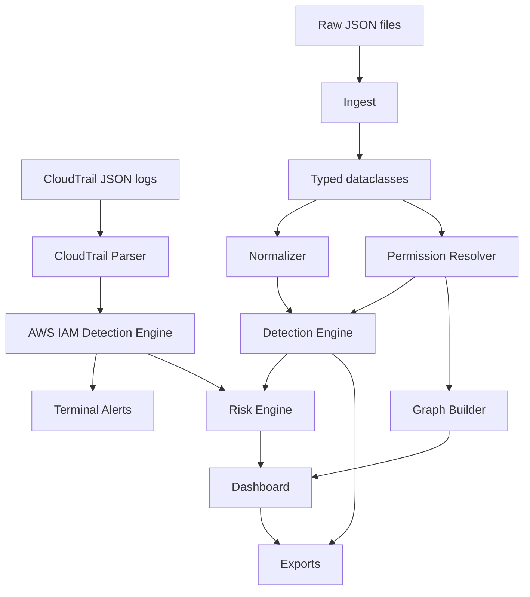

# Architecture

IdentityRiskGraph is a local-only defensive simulation. It does not connect to production identity providers, cloud APIs, or real tenant data.

## Pipeline

## Stages

1. **Raw JSON:** simulated users, groups, roles, permissions, devices, resources, events, and account changes.
2. **Ingest:** loads JSON into typed Python dataclasses.
3. **Normalizer:** converts raw events into an OCSF-inspired schema with actor, identity, device, activity, category, class, severity, endpoint, cloud, resource, status, and time.
4. **Permission Resolver:** calculates effective permissions from direct roles, group roles, nested group inheritance, deny permissions, and boundary-style constraints.
5. **CloudTrail Parser and AWS IAM Detection Engine:** load raw CloudTrail-style JSON, detect risky IAM control-plane events, print terminal alerts, and normalize the findings for dashboard investigation.
6. **Detection Engine:** evaluates deterministic identity-aware rules.
7. **Risk Engine:** converts identity context and findings into explainable 0-100 scores.
8. **Graph Builder:** creates a NetworkX graph and PyVis visualization for users, groups, roles, permissions, and resources.
9. **Dashboard:** exposes SOC-style workflows in Streamlit.
10. **Exports:** produces CSV, JSON, and Markdown artifacts.

## Design Goal

The app models how a SOC or IAM engineer would enrich security telemetry before scoring it. A raw login or export event becomes more meaningful when paired with account age, user type, endpoint trust, role assignment history, nested groups, and effective permissions.
