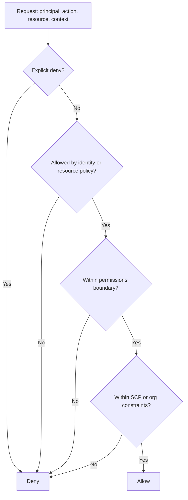

# AWS IAM Policy Logic

IdentityRiskGraph includes a CloudTrail-first workflow because AWS IAM risk often starts as a control-plane event: a policy attachment, group membership change, login profile creation, access key creation, or CloudTrail logging change.

## Core Policy Types

**Identity-based policies** are attached to IAM users, groups, or roles. They define what the principal can do.

**Resource-based policies** are attached to resources such as S3 buckets, KMS keys, or queues. They define who can access that resource.

**Permissions boundaries** set the maximum permissions an identity can receive from identity-based policies. They do not grant access by themselves.

**Service control policies, or SCPs,** apply at the AWS Organizations level. They define the maximum permissions available to accounts or organizational units.

**Explicit deny** wins over allow. If any applicable policy explicitly denies an action, the request is denied even if another policy allows it.

## High-Level Evaluation Flow

## Why Broad Permissions Become Risky

Broad permissions create toxic combinations when they allow an identity to both change access and reach sensitive data. For example, an identity that can attach policies, add group members, create access keys, and export regulated data has a larger blast radius than any one permission suggests on its own.

Nested or inherited access makes this harder to review. A user may not have direct AdministratorAccess, but a group policy or nested access path can create the same effective risk.

## Why These Events Matter

**AttachUserPolicy** is important because a managed policy can immediately change a single identity's effective permissions. Direct AdministratorAccess on a human or contractor identity is a high-signal event.

**AttachGroupPolicy** is important because one group-level change can affect every current member and any future member.

**AddUserToGroup** is important because group membership may be the real privilege boundary. Adding a user to an admin group can be equivalent to attaching an admin policy.

**PutUserPolicy** and **PutGroupPolicy** matter because inline policies are easy to miss in access reviews and can bypass managed-policy governance.

**CreateAccessKey** matters because it can create long-lived credentials for a human identity.

**StopLogging** and **DeleteTrail** matter because they reduce detection visibility and can indicate defense evasion.

